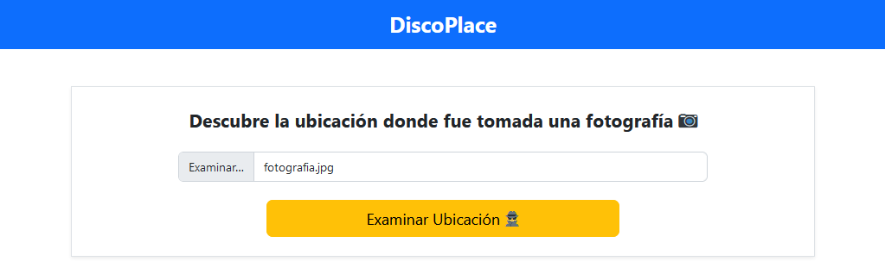
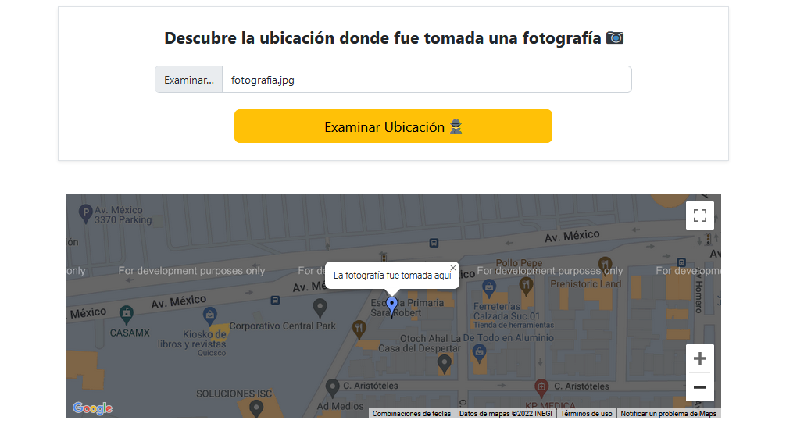

# DiscoPlace :detective:

**Discover the location where a photo was taken**

## Technologies :computer:

- PHP 8.3
- Dockerfile
- Bootstrap 5
- Jquery & AJAX
- Api de Google Maps

## Features :sparkles:

Retrieve the location where a photograph was taken

This works as long as the photograph is in `.jpg` or `.jpeg` format and its metadata has not been removed

## License :scroll:

This project is under the MIT license. See the [LICENSE](LICENSE) file for more details.

> This project was developed several years ago and may not be up-to-date with current technologies or best practices.
