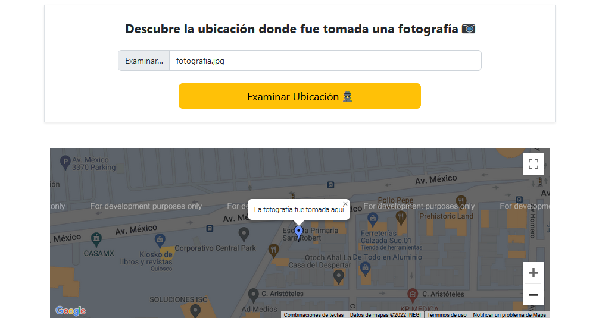

# DiscoPlace :detective:

Tecnologías utilizadas:

- PHP 7
- Bootstrap 5
- Jquery & AJAX
- Api de Google Maps

---

Esta aplicación puede:

- **Obtener la ubicación donde fue tomada una fotografía**

- **Siempre y cuando tenga extensión** `.jpg o .jpeg` **y sus metadatos no estén borrados**

